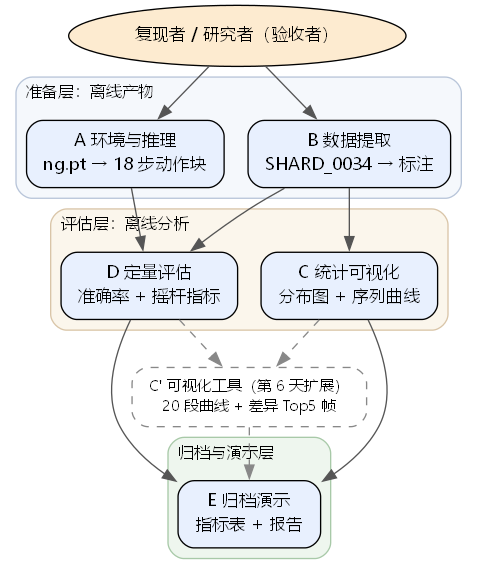

# 第 2 天报告：方案组成与技术选型

## 基本信息

- **课题**：课题七：通用游戏智能体（腾讯 IEG 课题）
- **成员**：独立完成（1 人，联络人即本人）

## 今日目标

确定课内交付的工作由哪些部分组成、各部分如何承接第 1 天立项书的必做项；对数据处理管线、推理评估方式、可视化工具做出技术选型并说明理由；把动作对齐关系与指标口径落到可执行的约定，使后续第 3～5 天可直接按此实现。

## 组成部分

按实验类课题分为五个部分，数据流与整体结构如下（实线为主路径，虚线为第 6 天扩展项；图源在 `assets/module_diagram.dot`，可由 Graphviz 一键重新生成）：

| # | 名称 | 职责 | 输入 → 输出 | 依赖谁 | 负责人 |
| --- | --- | --- | --- | --- | --- |
| A | 环境与官方推理 | 加载 ng.pt，提供单帧→动作块推理能力 | RGB 帧（1280×720）→ 18 步动作块（21 键 + 左/右摇杆） | — | 本人 |
| B | 数据提取 | 从 SHARD_0034 过滤 Hollow Knight 标注并落盘 | SHARD_0034.tar.gz → `annotations.parquet` + chunk 级 manifest | — | 本人 |
| C | 统计与可视化 | 按键/摇杆分布 + ≥10 条序列曲线 | `annotations.parquet` → 频率表 CSV + 分布图 PNG | B | 本人 |
| D | 定量评估 | 划分 ≥200 帧测试集，逐帧推理，与标注对齐计算指标 | 测试集标注 + 模型输出 → 指标表（双口径） | A、B | 本人 |
| E | 归档与演示 | 模型输出 vs 标注逐帧对照（表格/图），README 与结课报告实验说明 | 各部分产出 → 演示材料与报告 | C、D | 本人 |
| C'（扩展，第 6 天） | 可视化工具 | 批量导出 ≥20 段曲线 + 差异 Top-5 帧 | 模型输出 + 标注（D 的逐帧对齐结果）→ 曲线图 + 差异帧标注 | C、D | 本人 |

外部使用者：复现者 / 研究者（验收者），通过 README 的命令调用整条工具链。

**架构说明（按层解读）**：

- **准备层**（A、B）——纯离线产物，A 是模型加载与推理能力、B 是 Hollow Knight 标注数据；不依赖彼此，互为评估层的上游原料。
- **评估层**（C、D）——C 只消费 B 的标注做统计可视化；D 同时消费 A 的模型输出与 B 的标注做逐帧对齐与指标；C 与 D 并列，互不依赖。
- **归档与演示层**（E）——收 C 和 D 的产出，落到 README、指标表、演示材料、结课报告。
- **C'（扩展项，虚线）**——第 6 天的可视化工具，挂接在 C 与 D 之后，把"逐帧对齐结果"变成 20 段曲线 + 差异 Top-5 帧，最后也归档进 E。

**动作对齐约定（A 与 D 的接口依据，源码级实证）**：模型输出 18 步 × 25 维动作块 = [21 键（字母序）| 左摇杆 x,y | 右摇杆 x,y]；数据集标注为 17 键（字母序）+ 左/右摇杆，摇杆同为 [-1,1]、(-1,-1)=左上，坐标系一致可直接对齐。模型多出的 4 个 PS5 键在 xboxone 数据中不存在，评估按列名映射只比较 17 键。

**指标口径（D 的验收依据）**：按键准确率 = 逐帧逐键一致率（主口径 17 键全量，16 键去 `guide` 的论文口径并列报告）；摇杆指标 = MSE 与 Pearson 相关系数，按左/右摇杆 × x/y 分轴，验收基线以左摇杆相关系数 ≥0.4 为准；同时报告全帧与过滤 IDLE（17 键全 0 且摇杆 ≤0.1）两组口径。时序对齐：模型动作块第 k 步对齐标注帧 t+shift+k，shift 做扫描取最优并注明。

## 与需求的对应

对照清单：**第 1 天核心故事 → 负责模块 → 第 5 天是否演示该路径**（覆盖立项书全部"必做"6 条 + 可选扩展 1 条；每条故事都有"本课题"这个唯一负责人，对应模块均存在）。

| # | 第 1 天核心故事（立项书必做） | 负责模块 | 负责人 | 第 5 天演示该路径？ |
| --- | --- | --- | --- | --- |
| 1 | 跑通官方推理，README 可复现 | A | 本课题 | **否**（第 1 天冒烟测试已通过 SMOKE TEST PASSED，第 5 天不重演） |
| 2 | 单游戏 ≥500 帧标注统计与可视化 | B → C | 本课题 | **部分**：B 已是离线产物（1,444,200 帧）；C 的统计图与 ≥10 条序列曲线作为第 5 天演示材料 |
| 3 | 定量评估（≥200 帧测试集） | D | 本课题 | **是**（指标表 = 第 5 天演示核心） |
| 4 | zero-shot 基线达标或差距分析 | D | 本课题 | **是**（与必做 3 合并在指标表中同时报告） |
| 5 | 第 5 天演示（模型输出 vs 标注对照） | D → E | 本课题 | **是**（演示本身） |
| 6 | 归档交付与结课报告 | E | 本课题 | **否**（持续维护，第 9 天结课报告收束） |
| 选 | 可选扩展：可视化工具（≥20 段曲线 + 差异 Top-5 帧） | C'（第 6 天） | 本课题 | **否**（第 6 天才执行） |

**边缘情况处理**：

- **没有负责人的需求**：本课题独立完成，全部 7 条故事均由"本课题"承担；无悬空负责人。
- **没有对应故事的模块**：图中所有模块（外部使用者 A~E、C' 扩展）都对应到 1 条核心故事或可选扩展——A 对应故事 1；B 对应故事 2 的数据准备；C 对应故事 2 的可视化侧；D 对应故事 3/4/5；E 对应故事 5/6；C' 对应可选扩展。**无悬空模块**。
- **立项书"不做"清单**（不接实时闭环、不微调、不下全库）——不属于核心故事，与图中模块均无对应，边界保持一致。

> 注：第 5 天演示的核心是"模型输出 vs 标注对照"（必做 3/4/5 共用 D 的产出），其他必做（1、6、选）通过 README、统计图、最终报告等通道呈现——这是"主路径"在第 5 天的合理切分，不是缺失。

## 技术选型

**选型 1：数据表格处理——polars（入选）vs pandas（备选）**

- 入选理由：官方推理代码 `mm_tokenizers.py` 本身使用 polars 读取 parquet（分片内不含 `game_label` 列导致官方 game mapping 构建失败这一事实也是用 polars 直接读 parquet 实测发现的），与官方管线同构可避免两套库的 schema 差异；venv 已就绪无需新装；列式扫描 144 万行内存占用低。
- 放弃理由（pandas）：功能上完全可行，但需在 venv 补装 pyarrow/pandas 引入额外版本组合；且官方代码已经锁定 polars，混用两套 DataFrame 语义（如空列表列类型推断）徒增联调成本。已实测 polars 1.43.2 全量提取 1439 个 chunk 无性能问题（约 3 分钟）。

**选型 2：推理调用方式——本地直接调用 `InferenceSession`（入选）vs 官方 `serve.py` HTTP 服务（备选）**

- 入选理由：本课题评估离线进行（立项书课内交付边界），单机单进程逐帧推理即可；直接调用 `InferenceSession.predict()` 省去服务编排与进程间传图开销；与第 1 天冒烟测试同一代码路径，复现说明最短。
- 放弃理由（serve.py）：官方服务面向实时控制场景，HTTP 封装对离线批量评估只增加故障面；且服务模式需另开进程管理，不满足"他人按 README 一条命令跟做"的验收口径。

**选型 3：数据源口径——`actions_raw.parquet`（入选）vs `actions_processed.parquet`（备选）**

- 入选理由：raw 在全部 1439 个 chunk 均存在，口径统一；实测 processed 仅 535/1439 个 chunk 有，且论文说明 processed 含质量过滤与重映射（训练时按动作密度丢弃 45% 数据），混用会引入不可控的选择偏差。
- 处理办法：processed 的存在性逐 chunk 记入 manifest 备查，IDLE 干扰问题按立项书风险表用"评估侧双口径报告"解决，而非换数据源。

**选型 4：可视化——matplotlib 静态图（入选）vs 交互式工具 plotly/streamlit（备选）**

- 入选理由：交付物为报告插图与归档图表，静态 PNG 即满足验收；纯 CPU、零新增依赖；批量导出 ≥20 段曲线（第 6 天扩展）用循环出图即可。
- 放弃理由（交互式）：交互能力对"表格/曲线对照演示"无增量价值，反而增加环境依赖与演示时的不确定性。

指导书未限定技术栈，以上均为自主比较后确定；数据集来源、分片选择沿用第 1 天立项书结论（仅 SHARD_0034，不下全库），今日不重新选型。

## 今日完成与自检

**已确定的结论**：

1. 组成部分五模块划分与需求映射（上表），第 3～5 天按此推进；
2. 动作对齐关系与指标口径（17 键主口径 + 16 键论文口径并列、摇杆分轴 MSE/Pearson、全帧/过滤 IDLE 双口径）；
3. 四项技术选型及理由（polars、本地直调推理、actions_raw、matplotlib）；
4. 数据提取部分提前完成：`scripts/extract_hollow_knight.py` 全量跑通，Hollow Knight 共 6 视频 / 1439 chunks / 1,444,200 帧，与立项书选型数据一致；全量 IDLE 占比实测 37.2%（立项书抽样值 49.2% 的修正）、左摇杆移动率 19.2%。

**未定事项**：shift 时序对齐最优值（评估时扫描 {0..5} 确定）；测试集 200 帧的具体分层抽样规则（第 3 天定接口约定时一并写入项目备忘）。

## 问题、计划与 AI 沟通

**不成功的沟通**：

1. 请 AI 一次性编写"扫描+提取+合并"完整脚本，首版因不了解 tar 内成员物理顺序（同一 chunk 的 actions_raw.parquet 排在 metadata.json 之前，而游戏名在 metadata 里）逻辑混乱返工。改为先让 AI 写一个只读探查脚本摸清分片物理布局，再基于探查结论写提取脚本，一次通过。
2. 让 AI 用"只读每个视频 chunk_0000 的 metadata"做快速统计，得出"Hollow Knight 仅 2 视频 55 chunks"的错误结论；全量提取后发现 4 个视频缺 chunk_0000。教训：把"chunk_0000 必存在"当作隐含假设写进了提问，AI 按错误前提执行得很顺畅——提问前应先让结论可被交叉验证。

**比较有效的沟通**：

1. 给出完整源码文件（`mm_tokenizers.py`、`inference_session.py`）与数据集 README，要求"四处互证动作布局"，得到"模型 21 键 = 数据集 17 键 + 4 个 PS5 键、摇杆坐标系天然一致"的可复核结论，比只描述症状可靠得多。
2. 明确写出硬约束（不得下载数据集全库、评估离线进行、报告需可复现）后再请 AI 出方案，得到的选型自动收敛在约束内，无需反复修剪。

**明日安排**：

1. 定接口约定：统计/评估脚本的输入输出 schema（读取 `annotations.parquet`，输出指标表 CSV + 图表 PNG），连同今日的指标口径一并写入项目备忘初稿；
2. 确定测试集抽样规则（6 视频分层、固定随机种子）；
3. 数据提取已提前完成，视进度启动第 4 天的按键/摇杆分布统计与 ≥10 条序列可视化。
