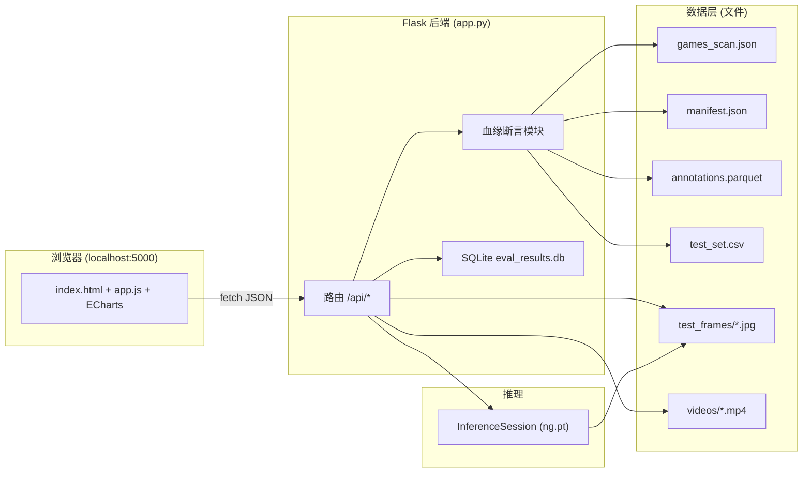

# 网页可视化平台实施文档

> 课题：通用游戏智能体（NitroGen 零样本评估）
> 目标：把"跑脚本翻 CSV/PNG"升级为"浏览器可视化工作台"，支撑第 5 天演示与结课报告。
> 本文档为工程实施依据，第 4~5 天按此开发；仅描述平台设计与实施步骤，不改动现有评估脚本逻辑。

---

## 1. 目标与范围

### 1.1 平台定位

本地单机 Web 应用（浏览器访问 `http://localhost:5000`），让用户**选择游戏与视频**后，通过三个页面完成 NitroGen 零样本评估的可视化：

| Tab | 功能 | 替代现在的 |
| --- | --- | --- |
| ① 模型识别 | 选一帧 → 显示模型预测动作块（手柄图 + 摇杆轨迹） | 翻 `predictions.csv` |
| ② 统计分布 | 按键触发率、摇杆热图、10 条序列曲线 | 翻 `stats/*.png` |
| ③ 序列对比 | 预测 vs 标注逐帧对照、差异 Top-5 帧（扩展 C） | 翻 `eval/predictions.csv` |

### 1.2 能做什么 / 不做什么

**能**：
- 一键浏览切片内含的游戏与视频（含下载链接、可用性状态）
- 选择 `(game, video)` 后，全程锁定该视频评估，杜绝数据血缘错配
- 逐帧交互识别（选帧 → 推理 → 展示，约 0.3s/帧，可接受）
- 查看已测结果的指标表（来自 SQLite 结果库）

**不做**：
- 不做实时视频流识别（模型 0.3s/帧，无法达到 30fps 实时）
- 不接入真实游戏进程（无 universal simulator，边界同立项书）
- 不做批量评估调度（评估仍由 CLI 脚本完成，平台只读其结果并展示）

---

## 2. 技术选型

### 2.1 后端：Flask

| 对比项 | Flask（选中） | FastAPI | Django |
| --- | --- | --- | --- |
| 上手成本 | 低（单文件可跑） | 中（需 ASGI 理解） | 高（全栈框架） |
| 依赖 | 少（werkzeug + jinja） | 较多（pydantic 等） | 很重（ORM/Admin/Auth） |
| 本机安装 | 系统 Python pip 可装 | 可装 | 可装 |
| 适用 | 轻量只读 JSON API | 高并发异步 | 大型业务系统 |

**理由**：平台是本地单机只读展示，5 个 JSON 接口 + 静态文件托管，Flask 单文件即可，依赖最少、演示环境最稳。venv 的 pip 有 SSL 问题，但**系统 Python 的 pip 正常**，用系统 Python 装 Flask 即可（`pip install flask -i 清华镜像`）。

### 2.2 前端：原生 HTML + JS + ECharts

| 对比项 | 原生 + ECharts（选中） | React/Vue | 纯静态图 |
| --- | --- | --- | --- |
| 构建 | 零构建零打包 | 需 npm 构建 | 无 |
| 交互 | ECharts 图表交互强 | 组件化但重 | 无交互 |
| 演示环境 | 浏览器直接开 | 需 node 环境 | 浏览器 |

**理由**：平台是演示工具，原生三文件（`index.html` + `app.js` + `style.css`）+ 一个 ECharts 本地 js 文件即可，避免引入 node 构建链。ECharts 用于手柄可视化、摇杆轨迹、分布热图、序列曲线（均可在线渲染，替代静态 PNG 展示）。

### 2.3 数据库：SQLite（结果库）

| 对比项 | SQLite（选中） | MySQL/PostgreSQL | 纯 JSON 文件 |
| --- | --- | --- | --- |
| 依赖 | Python 内置 `sqlite3`，零额外 | 需装服务 | 无 |
| 查询 | SQL（按游戏/视频查结果） | 强 | 需手写过滤 |
| 迁移 | 单文件 `eval_results.db` | 复杂 | 简单但弱 |

**理由**：只存"已测试结果"（每个 (game,video) 一条指标记录），数据量小、结构化、要查询。SQLite 零依赖（Python 内置），单文件易备份迁移，前端查库判断"已测试"状态。**全量标注仍在 parquet 文件层**，SQLite 不存大文件。

### 2.4 数据层：Parquet / JSON 文件（保持现状）

| 数据 | 文件 | 说明 |
| --- | --- | --- |
| 游戏目录 | `data/games_scan.json` | 89 游戏 → 视频 → URL |
| 视频档案 | `data/{game}/manifest.json` | 视频 url/分辨率/控制器 |
| 标注真值 | `data/{game}/annotations.parquet` | 全量帧标注（polars 读） |
| 测试集 | `data/{game}/test_set.csv` | 200 帧清单 |
| 画面帧 | `data/{game}/test_frames/*.jpg` | 模型输入 |
| 评估产物 | `data/{game}/eval/*.csv` | metrics + predictions |

**理由**：与官方格式同构、polars 秒读、只读分析。不引入 SQL 全量入库（53.8 万帧进库纯增复杂度）。

---

## 3. 系统架构



**数据流（以"选帧识别"为例）**：

```
1. 前端选 game=hades, video=v1805686899, frame=12345
2. GET /api/frame?game=hades&video=v1805686899&frame=12345
3. 后端血缘断言：(game,video) 与 test_set/manifest/annotations 三方一致
4. absolute_frame=12345 → second=12345/30=411.5s → ffmpeg 抽帧
5. 画面 → InferenceSession.predict() → 18 步动作块
6. (video,chunk,frame_idx) 关联 annotations 真值
7. 返回 {画面URL, 真值, 18步预测, shift对齐指标}
```

---

## 4. 数据库设计（SQLite 结果库）

### 4.1 文件位置

`data/eval_results.db`

### 4.2 表结构（DDL）

```sql
CREATE TABLE IF NOT EXISTS eval_results (
  game           TEXT NOT NULL,      -- 游戏名，如 hades
  video          TEXT NOT NULL,      -- 视频ID，如 v1805686899
  stats_frames   INTEGER,            -- 统计用帧数
  test_frames    INTEGER,            -- 测试集帧数（200）
  acc_17keys     REAL,               -- 按键一致率 17键（全帧）
  recall         REAL,               -- 按键召回率
  precision      REAL,               -- 按键精确率
  corr_jl_x      REAL,               -- 左摇杆相关 x
  corr_jl_y      REAL,               -- 左摇杆相关 y
  mse_jl         REAL,               -- 左摇杆 MSE
  best_shift     INTEGER,            -- 最优 shift（0~17）
  stats_plot     TEXT,               -- 按键分布图路径
  seq_plot       TEXT,               -- 10条序列图路径
  shift_scan     TEXT,               -- shift 扫描图路径
  test_set_csv   TEXT,               -- 测试集路径
  evaluated_at   TEXT DEFAULT (datetime('now','localtime')),
  PRIMARY KEY (game, video)
);
```

### 4.3 写入（评估脚本自动写库）

`evaluate.py` 跑完后自动 `INSERT OR REPLACE`（同 (game,video) 覆盖旧结果）。初始种子数据（已测）：

```sql
INSERT OR REPLACE INTO eval_results
  (game, video, stats_frames, test_frames, acc_17keys, recall, precision,
   corr_jl_x, corr_jl_y, mse_jl, best_shift,
   stats_plot, seq_plot, shift_scan, test_set_csv)
VALUES
  ('hades', 'v1805686899', 538200, 200, 0.954, 0.434, 0.388,
   -0.008, -0.011, 0.609, 6,
   'data/hades/stats/button_press_dist.png', 'data/hades/stats/sequences.png',
   'data/hades/eval/shift_scan.png', 'data/hades/test_set.csv'),
  ('lies_of_p', 'v2276819038', 21600, 199, 0.960, 0.528, 0.308,
   0.129, 0.009, 0.441, 7,
   'data/lies_of_p/stats/button_press_dist.png', 'data/lies_of_p/stats/sequences.png',
   'data/lies_of_p/eval/shift_scan.png', 'data/lies_of_p/test_set.csv');
```

### 4.4 读取（前端查库）

- `GET /api/games` 返回时，对每个 (game,video) 检查 `eval_results` 是否有记录 → 标记 `tested: true/false`
- `GET /api/frame` 返回时附带该 (game,video) 的指标（若有记录）

---

## 5. 后端 API 设计

统一约定：
- 所有接口返回 JSON；成功 `HTTP 200` + `{ok: true, data: ...}`
- 错误码：`400` 参数/血缘不匹配、`404` 游戏/视频不存在、`500` 推理/数据错误；错误体 `{ok: false, error: "..."}`

### 5.1 `GET /api/games`

**用途**：游戏下拉列表。

**请求**：无参数

**成功响应**（200）：
```json
{
  "ok": true,
  "data": {
    "games": [
      {"game": "hades", "videos": 5, "frames": 538200, "ready_videos": 1, "tested": true},
      {"game": "lies_of_p", "videos": 3, "frames": 21600, "ready_videos": 1, "tested": true},
      {"game": "dark_souls", "videos": 4, "frames": 1416000, "ready_videos": 0, "tested": false}
    ]
  }
}
```

**血缘断言**：无（全局目录查询）。

### 5.2 `GET /api/games/{game}/videos`

**用途**：视频下拉（含可用性状态）。

**请求**：`/api/games/hades/videos`

**成功响应**（200）：
```json
{
  "ok": true,
  "data": {
    "game": "hades",
    "videos": [
      {"video": "v1805686899", "url": "https://www.twitch.tv/videos/1805686899",
       "source": "twitch", "resolution": [1080, 1920], "controller": "xboxone",
       "status": "downloaded", "tested": true},
      {"video": "v1151006137", "url": "https://www.twitch.tv/videos/1151006137",
       "source": "twitch", "resolution": [1080, 1920], "controller": "xboxone",
       "status": "dead", "tested": false}
    ]
  }
}
```

**状态枚举**：`downloaded`（已在 `data/videos/`）/ `available`（URL 可下载未下载）/ `dead`（URL 失效）/ `unknown`（未探测）。

**失败例**（404）：`/api/games/nonexistent/videos` → `{"ok": false, "error": "game not found"}`

### 5.3 `GET /api/frame`

**用途**：单帧评估（核心接口）。

**请求**：`/api/frame?game=hades&video=v1805686899&frame=12345&shift=auto`

**血缘断言**（不符则 400）：
```
test_set 中存在 (video, frame) 且 video == 参数 video
annotations 中 (video, chunk, frame_idx) 能关联到
manifest.videos[video] 存在
```

**成功响应**（200）：
```json
{
  "ok": true,
  "data": {
    "frame": {"absolute_frame": 12345, "second": 411.5, "frame_path": "hades/test_frames/v1805686899_f12345.jpg"},
    "ground_truth": {"buttons": {"south": 1, "west": 0, "...": 0}, "j_left": [0.76, -0.58], "j_right": [0.0, 0.0]},
    "prediction": {
      "best_shift": 6,
      "buttons": {"south": 1, "west": 1, "...": 0},
      "j_left": [0.32, -0.41],
      "j_right": [0.0, 0.0]
    },
    "metrics": {"acc_17keys": 0.941, "n_mismatch": 1}
  }
}
```

**失败例**（400，血缘不匹配）：
```json
{"ok": false, "error": "video mismatch: test_set has v1805686899 but frame belongs to v1151006137"}
```

### 5.4 `GET /api/stats`

**用途**：统计分布。

**请求**：`/api/stats?game=hades&video=v1805686899`

**成功响应**（200）：
```json
{
  "ok": true,
  "data": {
    "stats_frames": 538200,
    "plots": {
      "button_press_dist": "/static/stats/hades/button_press_dist.png",
      "joystick_dist": "/static/stats/hades/joystick_dist.png",
      "sequences": "/static/stats/hades/sequences.png"
    },
    "summary": {
      "top_button": "south", "top_press_rate": 0.190,
      "idle_rate": 0.304, "left_stick_move_rate": 0.638
    }
  }
}
```

### 5.5 `GET /api/sequences`

**用途**：序列对比 + 差异 Top-5 帧（扩展 C）。

**请求**：`/api/sequences?game=hades&video=v1805686899`

**成功响应**（200）：
```json
{
  "ok": true,
  "data": {
    "n_sequences": 10,
    "plot_url": "/static/sequences/hades/compare.png",
    "top5_mismatch": [
      {"frame": 12345, "n_mismatch": 5, "gt": {"south": 1, "west": 0}, "pred": {"south": 0, "west": 1}},
      {"frame": 12346, "n_mismatch": 4, "...": "..."}
    ]
  }
}
```

---

## 6. 前端页面设计

### 6.1 整体布局

```
┌────────────────────────────────────────────────────────────┐
│ 顶部栏：NitroGen 评估工作台       [游戏▾] [视频▾] [重扫↻]   │
│ ────────────────────────────────────────────────────────── │
│ 当前选择：hades / v1805686899 (已下载)  血缘校验 ✅ 通过      │
│ ┌──────────┬──────────┬──────────┐                         │
│ │ ① 模型识别 │ ② 统计分布 │ ③ 序列对比 │  (Tab 切换)          │
│ └──────────┴──────────┴──────────┘                         │
└────────────────────────────────────────────────────────────┘
```

### 6.2 游戏/视频联动下拉

```
[游戏 ▾] hades ──────选中──────► [视频 ▾] 自动填充
                                    ├ v1805686899  (已下载 ✅)
                                    ├ v1151006137  (失效 ❌)
                                    └ ...
```

- 游戏下拉：`/api/games`（89 游戏），无已下载视频的灰显
- 视频下拉：`/api/games/{game}/videos`，状态徽标（已下载绿 / 可下载蓝 / 失效灰）
- 选中后 URL 带 `?game=&video=`，全部请求自动携带

### 6.3 Tab ① 模型识别

```
┌ 左侧：帧选择 ─────────────────┐  ┌ 右侧：结果 ────────────┐
│ [帧滑条/输入框] frame=12345    │  │ [手柄图] 按键点亮显示   │
│ [预览画面]                    │  │ [摇杆轨迹图] 左/右      │
│ [真值摘要] south=1 摇杆(0.76)  │  │ [指标] 一致率/差异键     │
└───────────────────────────────┘  └───────────────────────┘
```

### 6.4 Tab ② 统计分布

- 3 张图并排：按键分布 / 摇杆热图 / 序列曲线（ECharts 在线渲染，或直接 `` 引用已生成 PNG）
- 侧栏统计数字：top 按键、触发率、IDLE 率、摇杆移动率

### 6.5 Tab ③ 序列对比

- 选一段 120 帧 → 预测 vs 标注两条曲线叠画（按键事件、摇杆轨迹）
- 差异 Top-5 帧列表：点击 → 跳转 Tab ① 该帧详情
- 满足扩展 C（≥20 段曲线批量导出 + 差异最大 5 帧标注）

---

## 7. 用户体验设计

### 7.1 用户旅程

```
打开页面 → 自动加载游戏列表（≤1s）
  → 选游戏 → 视频下拉出现（含状态）
  → 选视频 → 若已测：直接看结果；若未测：提示"运行评估"
  → 切 Tab 看识别/统计/序列
  → 全程 URL 锁定 (game,video)，刷新不丢失
```

### 7.2 加载态

- 游戏列表加载：骨架屏
- 选帧推理：按钮转圈 + "推理中（约 0.3s/帧）..."
- 视频探测未完成：状态显示"探测中..." + 轮询刷新（后台异步）

### 7.3 错误提示

- 游戏/视频不存在：顶部红色横幅 + 404 信息
- 血缘不匹配：明确报错（"video mismatch..."），不静默
- 推理失败（OOM）：提示"显存不足，请关闭其他程序"

### 7.4 性能预期管理

- 推理 0.3s/帧：页面明示"单帧交互识别，非实时"
- 统计/序列图：首次加载后缓存，切 Tab 不重复请求

---

## 8. 数据血缘与帧同步

### 8.1 三层防线

| 层 | 机制 | 效果 |
| --- | --- | --- |
| 界面 | 游戏→视频联动下拉，选中后全程 `?game=&video=` | 用户无法选到其他视频 |
| 后端 | 每接口血缘断言（test_set/manifest/annotations 三方一致） | 不符返回 400 |
| 数据 | 产物 CSV 带 video 列 | 结果可追溯 |

### 8.2 帧同步（absolute_frame 统一主键）

```
absolute_frame（唯一主键）
   ├─→ second  = absolute_frame / fps        （喂 ffmpeg 抽帧）
   ├─→ chunk   = absolute_frame // chunk_size （定位 chunk）
   ├─→ local   = absolute_frame %  chunk_size （查 annotations 真值）
   └─→ shift 扫描 0~17 → 最优对齐              （模型输出 vs 真值）
```

验证三件套：
1. **锚点验证**：抽 3 个已知时间点帧，核对画面内计时器（LiveSplit）与 `second` 一致
2. **双向一致性断言**：test_set 抽 5 帧，`(video,chunk,local)` 查 annotations，断言与 csv 真值一致，不一致报错
3. **shift 容差**：标注有延迟（论文自承），shift 扫描吸收 ±几帧，两游戏最优 shift 8~12 步

### 8.3 fps 与 chunk_size 固化

| 游戏 | fps | chunk_size | 依据 |
| --- | --- | --- | --- |
| hades | 30 | 600 | manifest + 视频探针 |
| lies_of_p | 60 | 1200 | 同上 |

每个游戏写入 manifest 的 `fps`/`chunk_size` 字段，抽帧/关联全部派生，不靠猜。

---

## 9. 一键识别切片（游戏 + 下载链接）

### 9.1 `scripts/scan_shard.py`（正式化）

扫描 SHARD_0034 的 metadata → 输出 `data/games_scan.json`。

```
python scripts/scan_shard.py [--shard 路径] [--out data/games_scan.json]
```

- 输入：SHARD_0034.tar.gz（自动定位 HF 缓存，或 `--shard` 指定）
- 逻辑：遍历 tar 内 `metadata.json`，提取 `game` + `original_video.url`
- 输出：`{game: {videos, chunks, frames, urls: [{video, url, chunks}]}}`（89 游戏 311 视频）
- 耗时：约 3 分钟（流式单遍扫描）

### 9.2 `scripts/probe_videos.py`（可用性探测）

用 yt-dlp 逐个探测 URL 可用性 → 输出 `data/video_status.json`。

```
python scripts/probe_videos.py [--full] [--game hades]
```

- `--full`：全量 311 URL（约 10~20 分钟，后台跑）
- `--game hades`：单游戏（快，验证用）
- 输出：`{video: {status: downloaded/available/dead/unknown, duration, error}}`

### 9.3 后台异步探测（后端接口）

```
POST /api/rescan?scope=full|game=hades   → 触发后台探测线程，立即返回 202
GET  /api/rescan/status                  → {total, done, pending, results_so_far}
```

- 前端打开页面即调 `/api/games`（秒回清单），视频状态若未探测完显示"探测中..."并轮询 `/api/rescan/status`
- **不做前台阻塞**：探测在后台线程跑，页面始终可交互

---

## 10. 实施步骤与里程碑

| 阶段 | 内容 | 产出 |
| --- | --- | --- |
| **第 3 天下午** | ① 正式化 `scan_shard.py` + `probe_videos.py`（CLI 可跑）② 建 `eval_results.db` + 种子数据 ③ Flask `app.py` 骨架（5 接口路由 + 血缘断言模块） | 脚本可跑、库有数据、接口返回 JSON |
| **第 4 天** | ① 前端 `index.html` + `app.js` + `style.css`（选择器联动 + 三 Tab）② ECharts 手柄/摇杆/曲线渲染 ③ `/api/rescan` 后台异步 + 前端轮询 ④ 通用化 `evaluate.py`（写库）| 页面可用，能选游戏/视频、看三 Tab |
| **第 5 天** | ① 打磨 UI/UX（加载态/错误提示）② 端到端演示走查 ③ 第 3 天报告同步 ④ 演示 | 第 5 天演示素材齐备 |

---

## 11. 测试与验收

### 11.1 接口测试

```powershell
curl http://localhost:5000/api/games
curl "http://localhost:5000/api/games/hades/videos"
curl "http://localhost:5000/api/frame?game=hades&video=v1805686899&frame=25"
curl "http://localhost:5000/api/games/nonexistent/videos"   # 应返回 404
curl "http://localhost:5000/api/frame?game=hades&video=v1151006137&frame=25"  # 应返回 400 血缘不符
```

### 11.2 血缘验证清单

- [ ] 界面下拉只列选中游戏的视频
- [ ] 后端断言三方一致（test_set/manifest/annotations）
- [ ] 伪造 video 参数 → 400 且带明确错误信息
- [ ] 产物 CSV 带 video 列

### 11.3 演示清单（第 5 天）

- [ ] 打开页面 → 游戏下拉出现（89 游戏，hades 标记可测）
- [ ] 选 hades/v1805686899 → 视频状态"已下载" → 三 Tab 可用
- [ ] Tab① 选帧 12345 → 显示手柄图 + 摇杆 + 真值/预测对照
- [ ] Tab② 显示按键分布/摇杆热图/序列（数值与已生成 PNG 一致）
- [ ] Tab③ 差异 Top-5 帧列表可点击跳转
- [ ] 页面明示"单帧交互识别（0.3s/帧）非实时"

---

## 12. 风险与对策

| 风险 | 影响 | 对策 |
| --- | --- | --- |
| venv pip SSL 装包失败 | 依赖装不上 | 用系统 Python 装 Flask/ECharts（系统 pip 正常） |
| 视频源失效 | 无法抽帧 | 已测视频本地缓存（`data/videos/`）；探测标记 dead 不误导 |
| 推理 0.3s/帧 | 交互慢 | 明示非实时；选帧单次推理可接受 |
| 前端过度美化 | 超时 | 控制三 Tab + 原生 CSS，不过度工程化 |
| 血缘错配 | 指标错误 | 三层防线 + 断言测试（见第 8/11 节） |

---

## 附录 A：依赖清单

| 依赖 | 用途 | 安装 |
| --- | --- | --- |
| flask | 后端 | `python -m pip install flask -i https://pypi.tuna.tsinghua.edu.cn/simple` |
| polars | 读 parquet（venv 已装） | — |
| yt-dlp | 视频探测/下载 | `python -m pip install yt-dlp` |
| ECharts | 前端图表 | 下载 echarts.min.js 放 `web/static/js/`（离线可用） |
| ffmpeg | 抽帧 | imageio-ffmpeg（系统 python 已装） |

## 附录 B：启动命令

```powershell
# 0. 一键启动（推荐，演示用）：自动停旧实例 + 启动后端 + 打开浏览器
powershell -ExecutionPolicy Bypass -File scripts\start_web.ps1

# 1. 一键识别切片（可选，已有 games_scan.json 可跳过）
python scripts/scan_shard.py                          # 系统 Python 即可（无第三方依赖）
python scripts/probe_videos.py --game hades           # 单游戏探测（快）；--full 全量约 10~20 分钟

# 2. 建库 + 种子数据（首次）
python scripts/init_db.py                             # 系统 Python 即可

# 3. 启动后端（必须用 venv Python：flask/torch/nitrogen/polars 都在 venv）
NitroGen\.venv\Scripts\python.exe scripts\app.py      # -> http://localhost:5000

# 4. 评估新游戏并自动入库（通用化评估脚本）
NitroGen\.venv\Scripts\python.exe scripts\evaluate.py --game hades --video v1805686899 --fps 30
```

> 注意：`app.py` 与 `evaluate.py` 依赖 venv 中的 `nitrogen`/`torch`（推理）与 `polars`（读 parquet），
> 必须用 `NitroGen\.venv\Scripts\python.exe` 运行；`scan_shard.py` / `init_db.py` / `probe_videos.py`
> 仅用标准库 + yt-dlp，系统 Python 即可。

## 附录 C：目录结构（新增部分）

```
D:\general-gaming-AI\
├── scripts/
│   ├── app.py                 # [新增] Flask 后端（7接口 + 血缘断言 + rescan 后台探测）
│   ├── scan_shard.py          # [新增] 一键识别切片（游戏+下载链接）
│   ├── probe_videos.py        # [新增] 视频可用性探测（yt-dlp，可中断续跑）
│   ├── init_db.py             # [新增] 建库+种子
│   ├── evaluate.py            # [新增] 通用化评估（--game/--video/--fps，自动写库）
│   ├── start_web.ps1          # [新增] 一键启动脚本
│   └── ...（现有脚本不动）
├── web/
│   ├── index.html             # [新增] 前端入口（三 Tab）
│   └── static/
│       ├── app.js             # [新增] 交互逻辑（联动选择器 + ECharts 渲染）
│       ├── style.css          # [新增] 样式
│       └── js/echarts.min.js  # [新增] ECharts 本地文件（离线可用）
├── data/
│   ├── eval_results.db        # [新增] SQLite 结果库
│   ├── video_status.json      # [新增] 探测结果
│   └── ...（现有数据不动）
```
